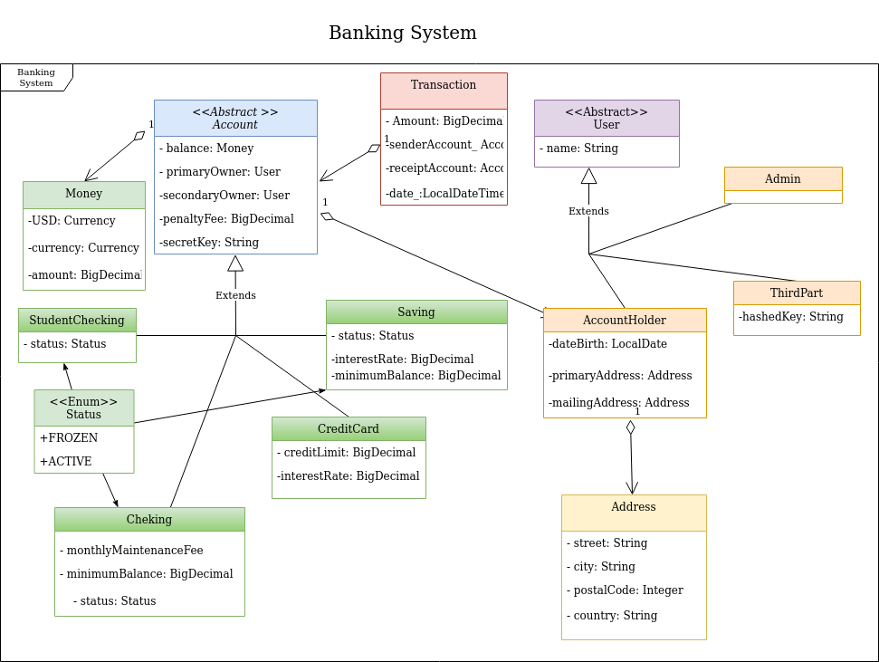
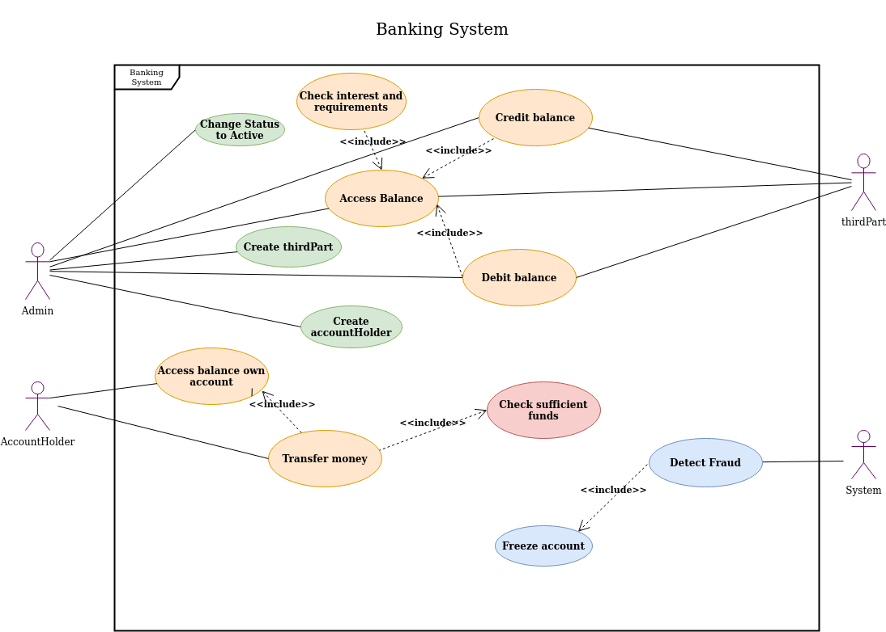

# Banking-System
The aim of this project is to build a banking system.
The system must have 4 types of accounts: StudentChecking, Checking, Savings, and CreditCard and  3 types of Users: Admins and AccountHolders.




## Main Functionalities
- Create new users
- Create accounts
- Access balance
- Debit and credit balance
- Accounts are freeze if any fraud pattern is detected
- Interest and penalties are applied when requiered.

### Api Documentation

| Method | Endpoint        |                    Response                     |
| ------ | --------------- | :---------------------------------------------: |
| GET    | /account-holders      |        retrieved data with all account-holders        |
| GET    | /account/saving/{id}  |    retrieved data of a specific saving account      |
| POST   | /third-party       |               Create new third-party               |
| PATCH    | /account/transaction    |       Debit or credit an account |
| POST    | /account/transfer| Make a transference from any of user's account to any other account |

To create account there are different options.
 - Create a new account and associate it with an existing accountHolder (primaryOwner and secondaryOwner). To do this, use optional query parameters.
 - Create a new account an a new AccountHolder (just a primaryOwner or a secondaryOwner too).
 - Combine both options, query parameters and owners added to the Json body, in order to associate an exisitng account holder as primary owner, as well as, creating a new accountHolder and associate it as secondary owner (or viceversa).

```
    {
        "balance":{
            "amount":"1000"
        },
        "primaryOwner":{
            "name":"cristian",
            "dateBirth":"1997-02-03",
            "primaryAddress":{
                "street":"cañadio",
                "city":"Santander",
                "country":"Spain",
                "postalCode":28033
            },
            "password":"aguacate"
        },
        "secretKey":"235"
    }
```

## Important Features
- Postman and Swagger can be used to test all the endpoints. 
- To run the program with swagger open http://localhost:8080/swagger-ui.html
- To run this project locally do the following after cloning the project:
 1. Create two databases: bankingSystem and bankingSystemTest.
 2. Run mvn spring-boot:run to launch the application.
 3. Use postman to test all the functionalities.

 ```
    CREATE SCHEMA bankingSystem;
    CREATE SCHEMA bankingSystemTest;
    USE bankingSystem;
    insert into user (dtype,username, password) values
    ("Admin","admin","$2a$10$mfW1eQhr5WVeWw1Pq2mZcu2fYG9QPK.gKPfA7amFIcAbroRaBAn3u");
    insert into role (role, user_id) values
    ("ROLE_ADMIN", 1),
    ("ROLE_THIRDPARTY",1);

```

- Security is applied to most of the routes. 
1. *Admins should be able to access the balance for any account, to debit the balance, and to credit the balance. Admins can also create thrid party and account users, and, change status of a frozen account to active.*
2. *Third Party users can debit or credit accounts of any type. To do so the must provide their hashed key in the header of the HTTP request. They also must provide the amount, the Account id and the account secret key.*
3. *Account holders should be able to transfer money from any of their accounts to any other account, as well as, access their own account balance.*

## Tools
- Spring JPA for data persistence
- Swagger
- MySQL
